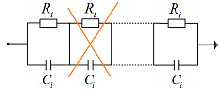

Wady materiału izolacyjnego, niedokładna impregnacja oraz mikro‑zanieczyszczenia powodują spadek rezystancji warstwy izolacyjnej i lokalny wzrost strat energii. Prowadzi to do miejscowego wzrostu temperatury, pojawienia się wyładowań niezupełnych, a w konsekwencji do powiększania się obszaru uszkodzonego i przebicia warstwy izolacyjnej. Proces ten znajduje odzwierciedlenie w wynikach pomiarów pojemności przepustów, które rosną zgodnie z zależnością N/(N–1) po przebiciu jednej warstwy, gdzie N oznacza liczbę warstw izolacyjnych w rdzeniu kondensatorowym.

    

W trakcie degradacji warstwy izolacyjnej początkowo rośnie wartość tan δ, przy stałym napięciu na warstwie. Po osiągnięciu punktu maksymalnego, gdy rezystancja warstwy jest już znacząco niższa, napięcie na niej zaczyna spadać — a wraz z nim wartość tan δ.

Przy obliczaniu tan δ jako funkcji rezystancji warstwy i częstotliwości widać, że krzywa tan δ ma maksimum, które przy wysokiej rezystancji pojawia się przy niskich częstotliwościach, a wraz ze spadkiem rezystancji przesuwa się w stronę wyższych częstotliwości. Krzywa pojemności przepustu wykazuje podobny efekt: początkowo, przy wysokiej rezystancji, jest płaska w całym zakresie częstotliwości. Wraz ze spadkiem rezystancji krzywa C odkształca się ku wyższym wartościom, a po przebiciu warstwy ponownie staje się płaska — lecz już na wyższym poziomie pojemności.